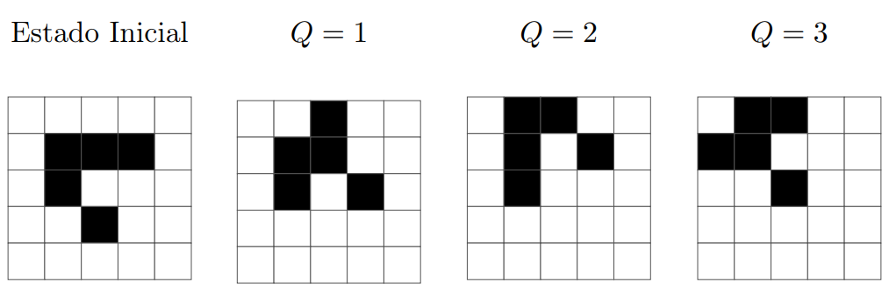

<h1 align="center">Jogo da Vida </h1>

  <i>Nome do arquivo:</i> <b>jogo.c</b>, <b>jogo.cpp</b>, <b>jogo.java</b>, <b>jogo.js</b> <i>ou</i> <b>jogo.py</b>

O Jogo da Vida de Conway é um processo de simulação (conhecido como *autômato celular*) criado pelo matemático britânico John Conway para reproduzir, por meio de uma matriz, processos de mudança em grupos de seres vivos. As regras do jogo indicam como a matriz é modificada a cada passo. Os valores da matriz em um determinado passo são coletivamente chamados de *estado* do jogo.

Mais especificamente, o jogo acontece em uma matriz quadrada *N × N* (ou seja, com *N* linhas e *N* colunas) no qual cada célula está viva (representada pelo número 1) ou morta (representada pelo número 0). Para simular o próximo estado do autômato, para cada célula calculamos o seu número de vizinhos vivos (duas células são consideradas vizinhas se elas são adjacentes diagonalmente, horizontalmente ou verticalmente – ou seja, uma célula pode ter até 8 vizinhas), e decidimos se a célula estará viva ou morta no próximo estado de acordo com as seguintes regras:

* se uma célula morta possui exatamente três vizinhas vivas, ela vira uma célula viva;
* se uma célula morta possui uma quantidade de vizinhas vivas diferente de três, ela continua morta;
* se uma célula viva possui duas ou três vizinhas vivas, ela continua viva;
* se uma célula viva possui menos que duas vizinhas vivas, ela morre;
* se uma célula viva possui mais que três vizinhas vivas, ela morre

Toda célula fora da matriz é considerada morta, ou seja, células fora da matriz nunca afetam a quantidade de vizinhos vivos de alguma célula. Observe que as regras são aplicadas em todas as
células simultaneamente, uma vez a cada passo.

Dada uma matriz que representa o estado inicial do jogo e um inteiro positivo *Q*, sua tarefa é determinar o *Q*-ésimo estado do jogo de acordo com as regras descritas acima, ou seja, o valor de cada célula da matriz após *Q* passos do jogo.

A figura abaixo mostra um exemplo de jogo em uma matriz *5 × 5* e seus estados para diferentes valores de *Q*. Células vivas são representadas com a cor preta e células mortas são representadas com a cor branca.

## Entrada

A primeira linha contém dois números inteiros, *N* e *Q*, representando, respectivamente, o número de linhas/colunas da matriz e o número de passos a serem simulados. 

As próximas *N* linhas contém *N* caracteres cada. O *j*-ésimo caractere da *i*-ésima linha representa o estado inicial da célula na linha *i* e coluna *j*. Caso o caractere seja ‘0’, a célula naquela posição inicia o jogo morta; caso o caractere seja ‘1’, a célula inicia o jogo viva.

## Saída

O seu programa deverá imprimir *N* linhas, cada uma contendo *N* caracteres. Na *i*-ésima linha, o *j*-ésimo caractere deve representar o *Q*-ésimo estado da célula na linha *i* e coluna *j*. Caso a célula esteja morta, o caractere deve ser ‘0’; se ela estiver viva, o caractere deve ser ‘1’.

## Restrições

* *1 ≤ N ≤ 50*
* *1 ≤ Q ≤ 100*

## Infromações sobre a pontuação

A tarefa vale 100 pontos. Estes pontos estão distribuídos em subtarefas, cada uma com suas **restrições adicionais** às definidas acima.
* **Subtarefa 1 (0 pontos):** Esta subtarefa é composta apenas pelos exemplos mostrados abaixo. Ela não vale pontos, serve apenas para que você verifique se o seu programa imprime o resultado correto para os exemplos.
* **Subtarefa 2 (30 pontos):** *Q = 1*.
* **Subtarefa 3 (70 pontos):** Sem restrições adicionais.

Seu programa pode resolver corretamente todas ou algumas das subtarefas acima (*elas não precisam ser resolvidas em ordem*). Sua pontuação final na tarefa é a soma dos pontos de todas as subtarefas resolvidas corretamente por qualquer uma das suas submissões

## Exemplos

|Exemplo de entrada                               | Exemplo de saída|
|:------------------------------------------------|:------------------------------------------|
|5 3 00000 01110 01000 00100 00000 | 01100 11000 00100 00000 00000 |
|15 1 000010000010000 000010000010000 000011000110000 000000000000000 111001101100111 001010101010100 000011000110000 000000000000000 000011000110000 001010101010100 111001101100111 000000000000000 000011000110000 000010000010000 000010000010000 | 000000000000000 000110000011000 000011000110000 010010101010010 011101101101110 001010101010100 000111000111000 000000000000000 000111000111000 001010101010100 011101101101110 010010101010010 000011000110000 000110000011000 000000000000000 |
|15 3 000010000010000 000010000010000 000011000110000 000000000000000 111001101100111 001010101010100 000011000110000 000000000000000 000011000110000 001010101010100 111001101100111 000000000000000 000011000110000 000010000010000 000010000010000 | 000010000010000 000010000010000 000011000110000 000000000000000 111001101100111 001010101010100 000011000110000 000000000000000 000011000110000 001010101010100 111001101100111 000000000000000 000011000110000 000010000010000 000010000010000 |